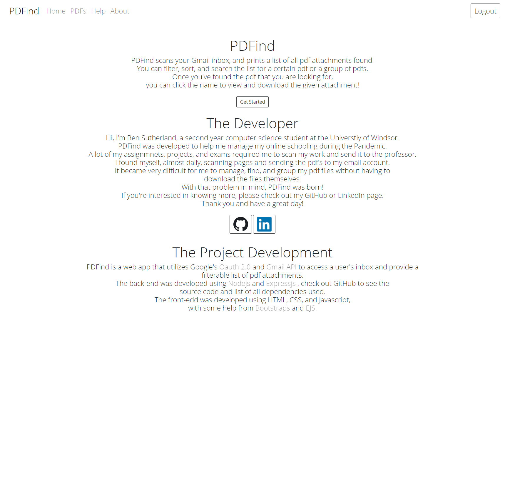

# PDFind (pdf-find)
A web app developed in Node.js to get pdf attachments from a user and allow the user to filter, search, sort, view and download the attachments.
The Back-end is developed using Express.js, Gmail API, Google OAUTH 2.0, and localStorage.
The front-end is developed using HTML, CSS, Bootstrap, and EJS

# Pre-requisites
- Install [Node.js](https://nodejs.org/en/)


# Getting started
- Clone the repository
```
git clone  <git lab template url> <project_name>
```
- Install dependencies
```
cd <project_name>
npm install
```
- Build and run the project
```
npm start
```
- Navigate to `http://localhost:3002`


## Contents
* [Home Page](#home-page)
* [Help Page](#help-page)
* [Usage](#usage)
* [About Page](#about-page)

## Home Page
The welcome page upon loading the app, you're unable to access your pdf attachments without logging in with Google first. 
The Get Started button will redirect the user to the [help page](#help-page), where they can see instructions on usage.


## Help Page
The help page, gives instructions and examples to show the wep app usage to the user.


## Usage
* Login with Google <br/>
  To begin using the app you need to login with google, you will be redirected to a Google authentication page.


* View the PDF <br/>
  After logging in, you can view your PDF list.


* Filter PDFs <br/>
  Use the "Filter your PDFs" button to filter the list based on name, date, or alphabetical order.


* Results of Filtering <br/>


## About Page
Contains details of the app, the development, and the developer (me).



