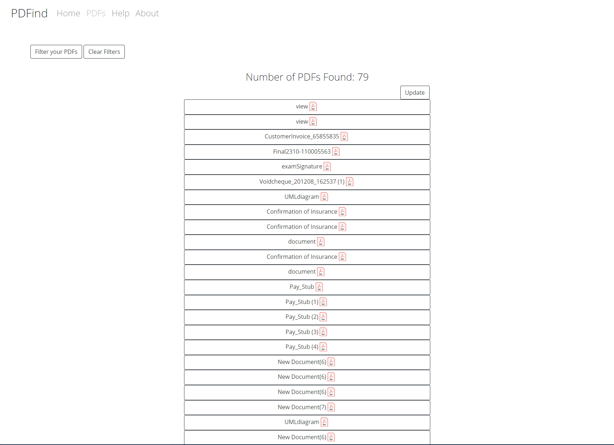

# PDFind (pdf-find)
A web app developed in Node.js to get pdf attachments from a user and allow the user to filter, search, sort, view and download the attachments.
The Back-end is developed using Express.js, Gmail API, Google OAUTH 2.0, and localStorage.
The front-end is developed using HTML, CSS, Bootstrap, and EJS

# Pre-requisites
- Install [Node.js](https://nodejs.org/en/)


# Getting started
- Clone the repository
```
git clone  <git lab template url> <project_name>
```
- Install dependencies
```
cd <project_name>
npm install
```
- Build and run the project
```
npm start
```
- Navigate to `http://localhost:3002`


## Contents
* [Home Page](#home-page)
* [Help Page](#help-page)
* [Usage](#usage)
* [About Page](#about-page)

## Home Page


## Help Page


## Usage




## About Page


